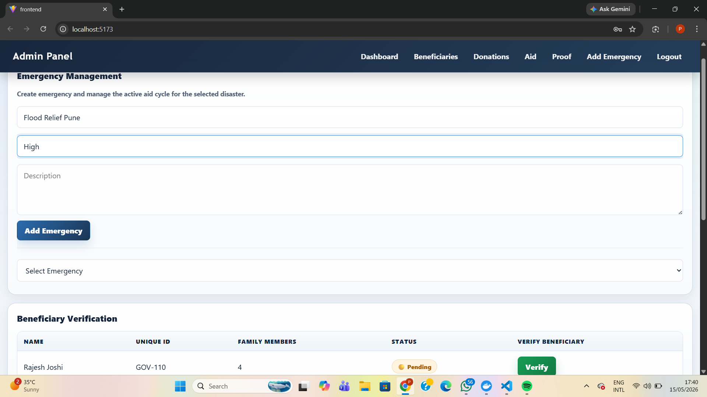
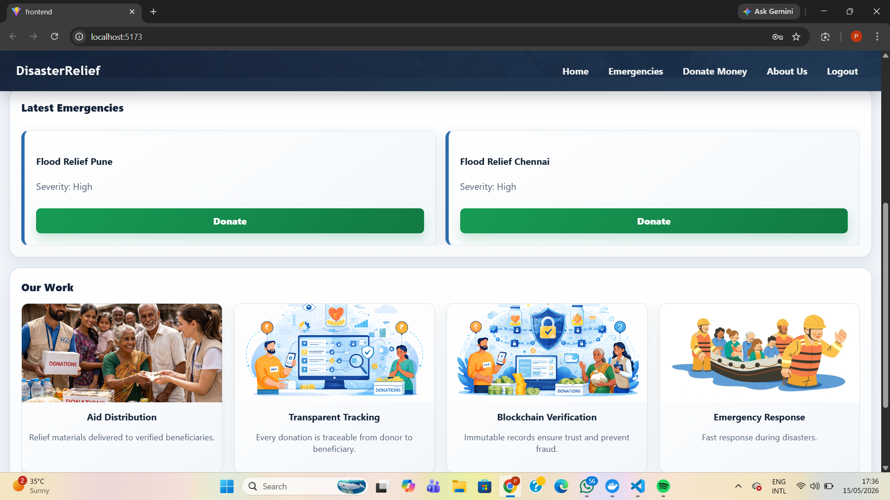
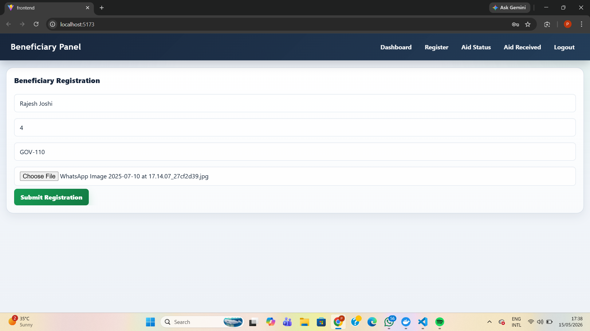
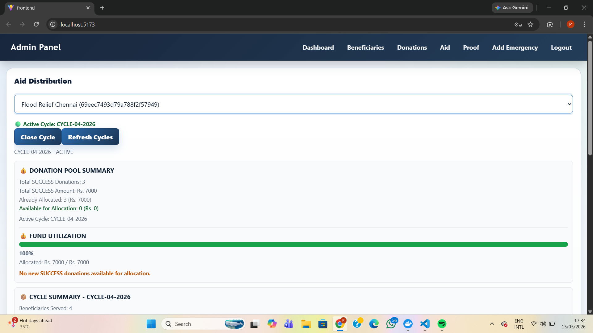
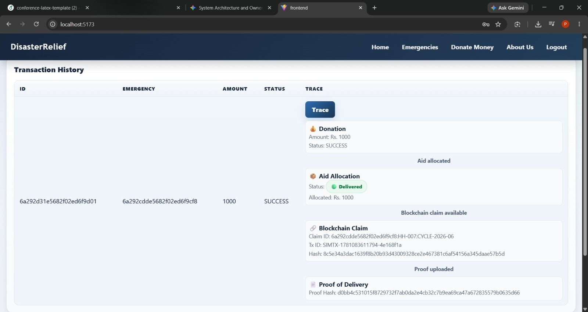

# Disaster Relief Donation Platform

A full-stack academic project for coordinating disaster-relief donations, beneficiary verification, aid allocation, proof of delivery, and audit-oriented tracing. The application provides separate interfaces for administrators, donors, and beneficiaries, with MongoDB as the operational data store and an optional Hyperledger Fabric integration for aid-claim and proof-hash records.

## Overview

Disaster-relief operations require a clear connection between raised funds, eligible households, allocated aid, and delivery evidence. This project models that process in a web application:

- Donors can view emergencies, create donation records, review their transaction history, and trace a donation.
- Beneficiaries can create an account, submit registration details, check verification status, and view allocated aid.
- Administrators can create emergencies, verify beneficiaries, manage aid cycles, allocate funds from successful donations, upload proof of delivery, and view reconciliation data.

The backend uses a blockchain adapter. It can connect to Hyperledger Fabric when configured, or use an in-memory mock adapter when Fabric is unavailable and fallback is enabled.

## Problem Statement

Relief programs need to record how donations are received, which households are eligible, how funds are allocated, and whether delivery evidence has been supplied. Fragmented records make this traceability difficult. The project addresses this by centralizing donation, beneficiary, aid-cycle, allocation, and proof records, while providing a Fabric-compatible audit trail for aid claims and proof hashes.

## Proposed System

The system is organized around three roles and an emergency-specific aid cycle:

1. An administrator creates an emergency and opens an aid cycle.
2. Donors create donations for an emergency. Donations become eligible for allocation after their payment status is `SUCCESS`.
3. Beneficiaries register and are approved by an administrator, receiving a household ID.
4. The administrator allocates an amount from a successful donation to one approved household during the active aid cycle.
5. The backend records the allocation in MongoDB and creates an aid claim through the configured blockchain adapter.
6. The administrator uploads delivery proof. The backend stores a SHA-256 proof hash, marks the aid as delivered, and submits the hash through the adapter.
7. Donors can retrieve a trace that links the donation, allocation, and available blockchain claim data.

## Key Features

- JWT-based authentication with `ADMIN`, `DONOR`, and `BENEFICIARY` roles.
- Donor and beneficiary account registration, plus administrator seeding through an existing backend script.
- Emergency creation and listing.
- Beneficiary registration, approval workflow, household IDs, and aid-status views.
- Donation creation, payment-status tracking, transaction history, and donation tracing.
- Aid-cycle start, close, status, and per-cycle summary endpoints.
- Manual aid allocation constrained to approved beneficiaries, active aid cycles, successful donations, and remaining donation balance.
- Proof-of-delivery file upload with SHA-256 hashing and `ALLOCATED` to `DELIVERED` status transition.
- Financial reconciliation and allocation summaries for an emergency.
- Hyperledger Fabric-compatible `aidcc` chaincode implementing `CreateAidClaim`, `SubmitProofHash`, and `ReadClaim`.
- Mock blockchain adapter for local execution when Fabric fallback is enabled.

## Technology Stack

| Layer | Technologies present in this repository |
| --- | --- |
| Frontend | React, Vite, React Router, Axios |
| Backend | Node.js, Express, CORS, dotenv |
| Database | MongoDB, Mongoose |
| Authentication | JSON Web Tokens, bcryptjs |
| File upload | Multer |
| Blockchain | Hyperledger Fabric Node SDK, Fabric chaincode API/shim |
| Local services | Docker Compose with MongoDB 6.0 |

## User Roles and Permissions

| Role | Implemented permissions |
| --- | --- |
| Administrator | Create emergencies; view and verify beneficiaries; start and close aid cycles; inspect donation, allocation, cycle, and reconciliation data; allocate aid; upload delivery proof. |
| Donor | Register and sign in; view emergencies; create donations; view personal transactions; trace own donations. |
| Beneficiary | Register and sign in; submit beneficiary details; view verification status, aid status, and personal aid records. |

The backend enforces role checks for administrator, donor, and beneficiary routes. Payment confirmation is restricted to an administrator or a request carrying the configured payment-webhook secret; a real payment-gateway integration is not included.

## System Workflow

```text
Donor account -> Donation (PENDING) -> Authorized confirmation (SUCCESS)
                                              |
Beneficiary account -> Registration -> Admin approval -> Household ID
                                              |
Admin creates emergency -> Opens aid cycle -> Allocates eligible donation
                                              |
                                  MongoDB aid record + blockchain claim
                                              |
                         Admin uploads proof -> Hash stored -> DELIVERED
                                              |
                           Donor trace -> donation + aid + claim details
```

## Project Structure

```text
.
├── backend/
│   ├── src/
│   │   ├── blockchain/        # Fabric and mock adapters
│   │   ├── controllers/       # Auth, admin, donor, beneficiary flows
│   │   ├── middleware/        # JWT and role authorization
│   │   ├── models/            # MongoDB schemas
│   │   └── routes/            # HTTP API routes
│   ├── fabric/chaincode/aidcc/# Fabric chaincode for aid claims
│   ├── .env.example           # Backend environment template
│   └── docker-compose.yml     # MongoDB service definition
├── frontend/
│   └── src/                   # React UI, pages, components, API client
├── fabric-samples/            # Hyperledger Fabric samples and test network
└── scripts/
    └── cleanup-db.js          # Database cleanup utility
```

## Prerequisites

- Node.js and npm. The `aidcc` chaincode declares Node.js `>=18`.
- MongoDB, either installed locally or run with the included Docker Compose file.
- Docker and Docker Compose for the included MongoDB service and for the Fabric test network.
- A Bash-compatible terminal, Hyperledger Fabric binaries, and Fabric Docker images only when using the optional Fabric network. The included `fabric-samples` documentation describes the Fabric prerequisites.

## MongoDB Setup

From the repository root, start the MongoDB service defined in `backend/docker-compose.yml`:

```powershell
docker compose -f backend/docker-compose.yml up -d mongo
```

The backend template is configured for a local MongoDB endpoint:

```env
MONGO_URI=mongodb://localhost:27017/disaster-relief
```

## Environment Variables

Create `backend/.env` from [`backend/.env.example`](backend/.env.example). Do not commit the resulting `.env` file.

```powershell
Copy-Item backend/.env.example backend/.env
```

Configure these variables using local, non-secret values appropriate to your environment:

| Variable | Purpose |
| --- | --- |
| `MONGO_URI` | MongoDB connection string used by the backend. |
| `JWT_SECRET` | Secret used to sign and verify JSON Web Tokens. |
| `PORT` | Backend HTTP port; the frontend API client uses `http://localhost:3000`. |
| `ADMIN_EMAIL` | Initial administrator email used by `npm run seed`. |
| `ADMIN_PASSWORD` | Initial administrator password used by `npm run seed`. |
| `ADMIN_NAME` | Initial administrator display name used by `npm run seed`. |
| `BLOCKCHAIN_PROVIDER` | Blockchain provider selection. Use `fabric` for the Fabric adapter or `mock` for the in-memory adapter. |
| `BLOCKCHAIN_FALLBACK_TO_MOCK` | When not `false`, allows Fabric adapter failures to fall back to the mock adapter. |
| `FABRIC_CONNECTION_PROFILE` | Path to the Fabric connection profile, resolved from the backend working directory. |
| `FABRIC_WALLET_PATH` | Path to the Fabric filesystem wallet, resolved from the backend working directory. |
| `FABRIC_IDENTITY` | Wallet identity used by the Fabric gateway. |
| `FABRIC_CHANNEL` | Fabric channel name. |
| `FABRIC_CHAINCODE` | Fabric chaincode name. |

`PAYMENT_WEBHOOK_SECRET` is also read by the backend when validating payment-webhook requests. It is not included in the checked-in environment template; set it locally only when using that workflow.

## Backend Setup

Install backend dependencies and create the administrator account after MongoDB is available:

```powershell
cd backend
npm install
npm run seed
npm run dev
```

The backend also provides `npm start` for `src/server.js`. It listens on the `PORT` value from `backend/.env`, defaulting to `3000`.

## Frontend Setup

In a separate terminal, install the frontend dependencies and start Vite:

```powershell
cd frontend
npm install
npm run dev
```

The frontend API client is currently configured to call `http://localhost:3000`, so keep the backend running on that address unless the client configuration is updated.

## Hyperledger Fabric Setup

Fabric support is included but optional. The backend has a Fabric adapter, a mock fallback adapter, the `aidcc` chaincode package, a connection profile, and the `fabric-samples/test-network` script.

For local development without a Fabric network, retain the template setting `BLOCKCHAIN_FALLBACK_TO_MOCK=true` or use `BLOCKCHAIN_PROVIDER=mock`. The mock adapter stores claims only in backend process memory, so they do not survive a backend restart.

To use Fabric, first install the prerequisites, binaries, and Docker images described in [`fabric-samples/README.md`](fabric-samples/README.md). Then, from a Bash-compatible terminal, the included test-network script supports starting a channel and deploying this repository's JavaScript chaincode:

```bash
cd fabric-samples/test-network
./network.sh up createChannel -c mychannel
./network.sh deployCC -c mychannel -ccn aidcc -ccp ../../backend/fabric/chaincode/aidcc -ccl javascript
```

Before starting the backend in Fabric mode, provision the wallet identity named by `FABRIC_IDENTITY` and point `FABRIC_CONNECTION_PROFILE` and `FABRIC_WALLET_PATH` at the corresponding local artifacts. Set `BLOCKCHAIN_FALLBACK_TO_MOCK=false` when a Fabric-only workflow is required.

## How to Run the Project

1. Start MongoDB with the included Docker Compose command, or provide another reachable MongoDB instance through `MONGO_URI`.
2. Create `backend/.env` from `backend/.env.example` and set a secure local `JWT_SECRET` and administrator credentials.
3. In `backend`, run `npm install`, `npm run seed`, and `npm run dev`.
4. In `frontend`, run `npm install` and `npm run dev`.
5. Open the local Vite address printed by `npm run dev` and sign in with the seeded administrator account, or register a donor or beneficiary account.
6. Optionally configure Fabric as described above. With mock fallback enabled, the backend remains usable when a Fabric gateway cannot connect.

## Screenshots

Add project screenshots to `docs/screenshots/` and replace these placeholders before publishing:

| Screen | Placeholder |
| --- | --- |
| Login | `docs/screenshots/login.png` |
| Administrator dashboard | `docs/screenshots/admin-dashboard.png` |
| Donor dashboard and trace | `docs/screenshots/donor-dashboard.png` |
| Beneficiary dashboard | `docs/screenshots/beneficiary-dashboard.png` |

## Future Scope

- Integrate a real payment gateway and a production webhook verification flow.
- Add automated tests for API authorization, aid allocation, and chaincode behavior.
- Add production deployment configuration, persistent file storage, and stronger file-validation controls.
- Automate Fabric identity enrollment and network configuration for the application.
- Extend reporting and audit exports for emergency operations.

## Screenshots

### Admin Aid Distribution


### Donor Dashboard


### Beneficiary Registration


### Admin Verification


### Donation Traceability


## License

No project-specific license file is currently present in the repository.
